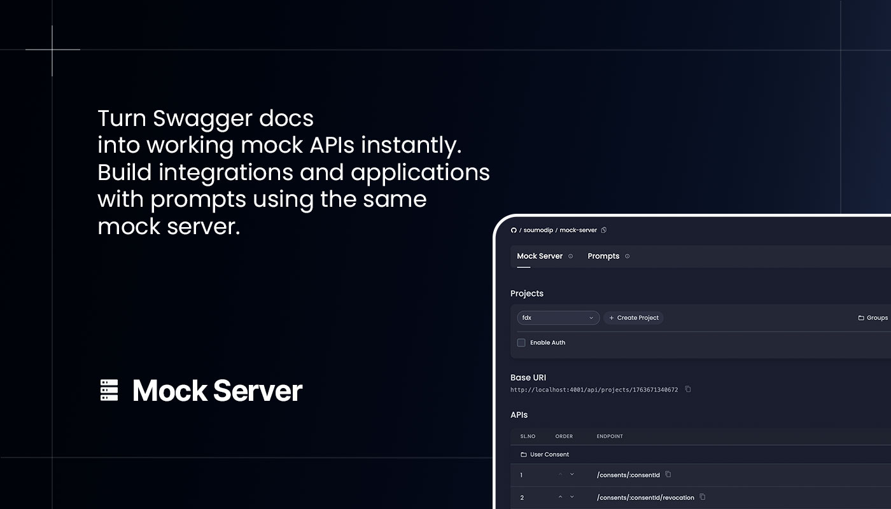
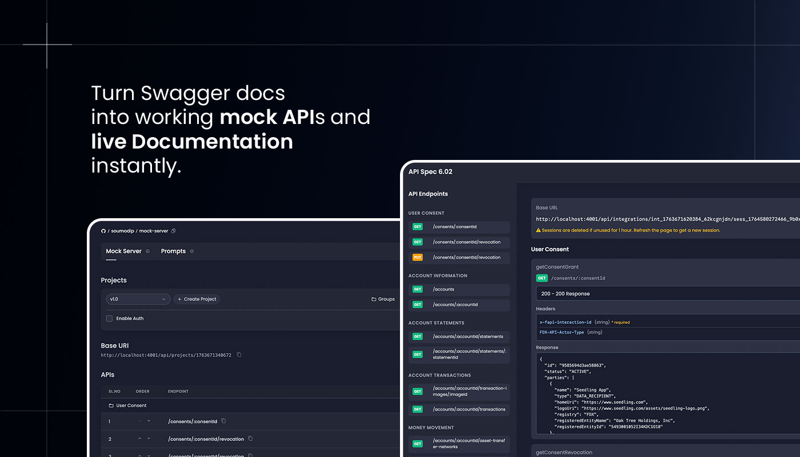
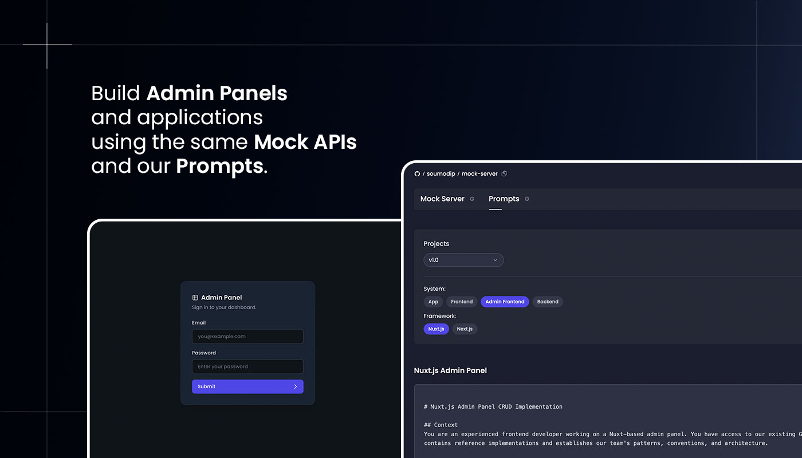

<p align="center">
  <a href="https://github.com/soumodippaul/mock-server/blob/main/LICENSE"></a>
  <a href="https://in.linkedin.com/in/soumodippaul"></a>
</p>

<div align="center">
  
</div>

##

Mock Server is a flexible tool that allows developers to quickly generate and manage mock API servers from Swagger/OpenAPI specifications.
Perfect for frontend development, testing, and prototyping when the backend isn't ready yet.

Build complete apps using mock-server as your backend, then swap it for your production server using our prompts. This workflow supercharges LLM-powered development—generate specs with AI, prototype instantly, and transition to production seamlessly.

Setup guide:

```bash
git clone https://github.com/soumodip/mock-server
cd mock-server
npm install --legacy-peer-deps
npm run setup-data
npm run dev
```

## Why use Mock Server?

- **🚀 Rapid Development**: Generate fully functional mock servers from Swagger/OpenAPI files in seconds
- **🎨 Customizable Responses**: Change response types and customize API behavior to match your needs
- **🧪 API Testing**: Built-in API Playground compatible with Postman and other testing tools
- **⚡ Build Applications**: Create Frontend, Admin Panels, or Mobile Apps using the mocked APIs without waiting for backend
- **🔧 Backend Development**: Develop backend services against mock specifications
- **📚 Auto-Generated Documentation**: Get a documentation URL for your mock backend automatically
- **🔗 Webhook Testing**: Test and debug webhooks locally with a dedicated endpoint and request logging

## Mock Server Capabilities

### Integrations

Mock Server seamlessly integrates with your development workflow:
- **API Clients**: Compatible with Postman, and other API testing tools
- **CI/CD Pipelines**: Integrate mock servers into your automated testing workflows
- **Development Frameworks**: Supports Nuxt(vue), Next.js(react), Flutter and React Native frameworks.
- **Backend Services**: Use as a staging environment for backend development
- **OpenAPI Standards**: Full support for OpenAPI 3.0 and Swagger 2.0 specifications

The integration capabilities ensure that Mock Server fits naturally into your existing development ecosystem.

<div align="center">
  
</div>

### Intelligent Prompt System

The Mock Server comes with specialized prompts for different application types:
- **Frontend Prompt**: Build your frontend application with the mock server as the backend
- **Admin Panel Prompt**: Create admin dashboards that connect to the mock API
- **Mobile App Prompt**: Develop mobile applications using the mock server endpoints

These prompts help you rapidly build complete applications using the mock server as your backend, allowing you to develop and test your frontend without waiting for the real API.

Once your frontend is ready, use our **Backend Prompt** to build a production-ready server that matches the mock API structure. Simply replace the mock server with your new backend, and your entire stack is ready to deploy.

<div align="center">
  
</div>

### Webhook Testing

Test and debug webhooks during development without deploying to a public server:
- **Local Webhook Endpoint**: Receive webhook payloads at a dedicated URL and inspect headers, body, and metadata
- **Request Logging**: View a complete history of all incoming webhook requests with timestamps and full payload details

## Installation & Usage

### Prerequisites

- Node.js (v16 or higher)
- npm, pnpm, yarn, or bun

### Setup

Install dependencies:

```bash
npm install --legacy-peer-deps
```

Setup the data folder:

```bash
npm run setup-data
```

### Development Server

Start the development server on `http://localhost:4001`:

```bash
npm run dev
```

### Production

Build the application for production:

```bash
npm run build
```

Run the production server using PM2:

```bash
# Install pm2 globally
npm install -g pm2
# Start the server
npm run start
```

(Optional) Lifecycle commands:

```bash
# View logs
npm run logs
# Restart the server
npm run restart
# Stop the server
npm run stop
```

### Docker

Run the application using Docker:

```bash
# Build and start the container
docker-compose up -d

# View logs
docker-compose logs -f

# Stop the container
docker-compose down
```

The application will be available at `http://localhost:4001` (or the port specified in your `.env` file).

**Configuration:**
- Environment variables are loaded from `.env` file
- The `data/` folder is mounted as a volume for persistent storage
- Modify `.env` to customize port, authentication, and other settings

## Additional Resources

- **[Configuration Guide](CONFIGURATION.md)**: Detailed configuration options including authentication, environment variables, and data storage
- **[Contributing](CONTRIBUTING.md)**: Guidelines for contributing to this project
- **[License](LICENSE)**: MIT License details

<br/><br/>

<div align="center">
  <p>Developed by <strong>Soumodip Paul</strong></p>
  <p>For consultation or support related to Mock Server, feel free to reach out to <a href="mailto:soumodippaul@gmail.com">soumodippaul@gmail.com</a></p>
</div>
